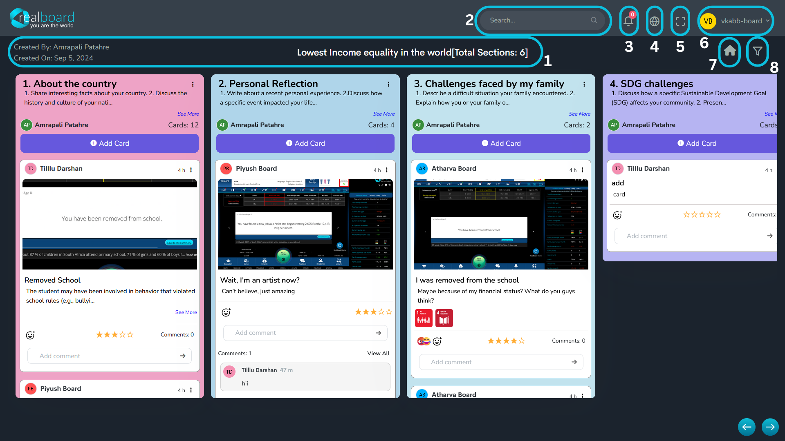

# RealBoard Användargränssnitt

<figure><figcaption></figcaption></figure>

RealBoards gränssnitt är utformat för att ge en intuitiv och organiserad användarupplevelse. Nedan finns en guide för att förstå de olika elementen i användargränssnittet, från vänster sida och över skärmen.

## Numrering med information nedan:

## 1. Tavleinformation

Uppe till vänster på skärmen hittar du viktig information om tavlan du tittar på:

* **Skapad av**: Visar namnet på den person som skapade tavlan.
* **Skapad den**: Visar datumet när tavlan skapades.
* **Tavlans Titel**: I fetstil visas titeln på tavlan (t.ex. "Född i ett land där äktenskapsåldern är den lägsta").
* **Totala Sektioner**: Inom parentes bredvid tavlans titel kan du se det totala antalet sektioner inom tavlan.

## 2. Sökfält

Till höger om tavlans titel ser du ett **Sökfält**. Detta låter dig söka efter specifik text, kortnamn, nyckelord eller annat innehåll inom tavlan. Det hjälper dig att snabbt hitta information utan att manuellt behöva bläddra genom sektionerna.

## 3. Notifikationsikon

Bredvid sökfältet hittar du **Notifikationsikonen**. Denna ikon varnar dig för nya notiser, såsom kommentarer på dina inlägg, uppdateringar från lärare/professorer eller nya uppgifter. En röd prick indikerar när du har olästa notiser.

## 4. Språkövergångsikon

**Språkövergångsikonen** låter dig byta gränssnittsspråk. För närvarande stöder RealBoard tre språk:

* **Engelska**
* **Svenska**
* **Koreanska**

Du kan byta språk när som helst genom att klicka på ikonen och välja ditt föredragna språk.

## 5. Minimera/Maximera Ikon

Till höger om språkikonen finns **Minimera/Maximera Ikonen**. Denna låter dig växla storleken på gränssnitts-fönstret, så att du kan arbeta i en mer kompakt vy eller expandera det för bättre översikt över alla sektioner och kort.

## 6. Användarprofil

Längst till höger på toppbaren finns en **Användarprofilcirkel**. Den visar din profilbild och ditt användarnamn. Genom att klicka på detta får du tillgång till dina kontoinställningar och profilalternativ.

## 7. Hemknapp

Under toppbaren, till vänster, hittar du **Hemknappen**. Genom att klicka på denna kommer du till RealBoards huvudsida, där du kan visa och komma åt alla dina tavlor.

## 8. Filteralternativ

Bredvid hemknappen finns **Filterikonen**, som ger två typer av filter för att hjälpa dig sortera och hitta relevant innehåll på tavlan:

1. **Vanligt Filter**:
   * **Mest kommenterade kort**: Sorterar korten i tavlan efter antalet kommentarer.
   * **Mest reagerade kort**: Sorterar korten efter antalet reaktioner.
2. **Filtrera efter användare**:
   * Låter dig filtrera och visa kort och sektioner som postats av specifika användare på tavlan.
